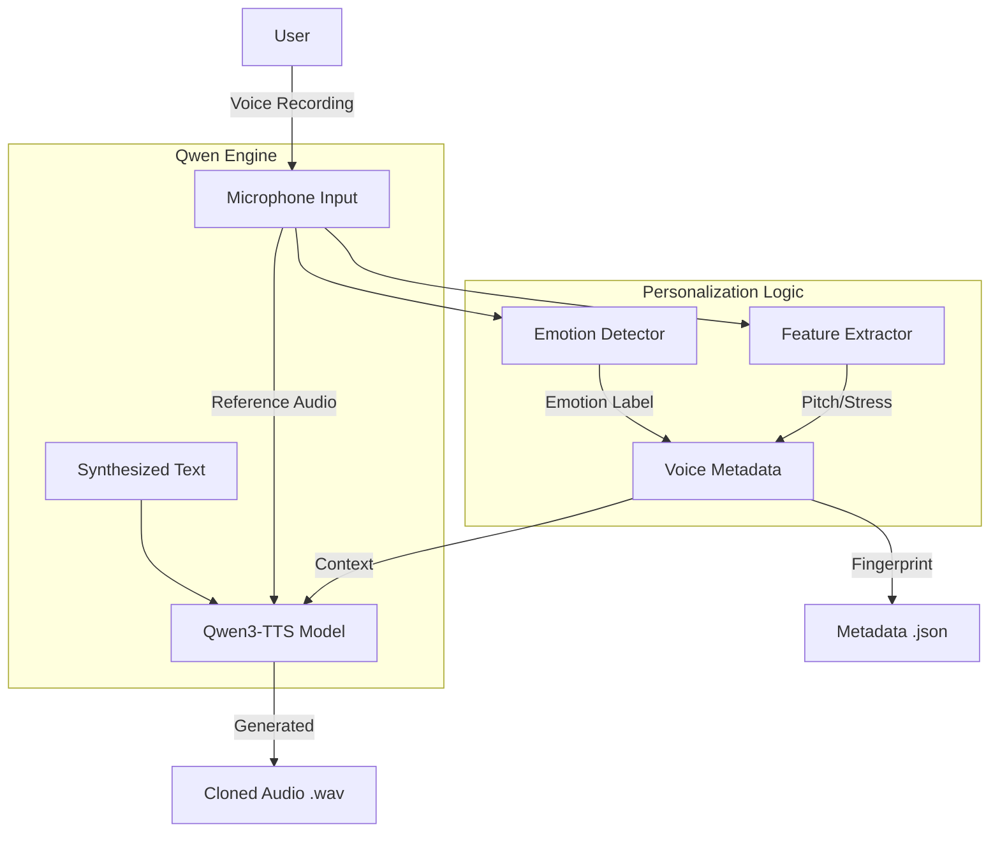

# System Architecture

The TTS Personalization Engine is a high-performance voice cloning pipeline. Originally based on Piper TTS, it has been evolved into a sophisticated **Zero-Shot Voice Cloning** system powered by the **Qwen3-TTS** model. It enables real-time extraction of user-specific speech patterns and emotions, coupling them with large-scale pre-trained models for state-of-the-art synthesis.

## High-Level Architecture

The system follows a modular adapter-based architecture:

1.  **Input Layer**: Captures live microphone input or batch `.wav` files.
2.  **Analysis Layer**: Extracts F0 pitch contours, energy profiles, and emotional state using Librosa and SVM classifiers.
3.  **Core Intelligence**: The **Qwen3-TTS (0.6B/1.7B)** transformer model, which performs zero-shot cloning (transferring style from reference to new text).
4.  **Adapter Layer**: A Windows-optimized PyTorch wrapper that provides an MLX-style API for cross-platform compatibility.
5.  **Data Layer**: Dual output system saving both the synthesized audio (`.wav`) and its diagnostic fingerprint (`.json`).

## Component Details

### 1. Analysis Engine (`personalization_engine.feature_extractor`)
Derived from signaling processing research, this component computes the "Voice DNA".
*   **Pitch Analysis**: Fundamental Frequency (F0) tracking to capture user register.
*   **Energy/Stress**: RMS energy mapping to understand emphasis patterns.
*   **Speaking Rate**: Syllables-per-second estimation.

### 2. Emotion Intelligence (`personalization_engine.emotion_detector`)
A machine learning module that classifies the atmospheric "vibe" of the input.
*   **Model**: SVM Classifier (`svm_model.pkl`).
*   **Dynamic Response**: Detects 7 core emotions including Happy, Sad, Angry, and Calm.

### 3. Qwen Adapter (`personalization_engine.qwen_adapter`)
The heart of the new system, providing a high-level interface for complex model interactions.
*   **Zero-Shot Cloning**: Unlike legacy systems, Qwen does not require fine-tuning; it uses **In-Context Learning (ICL)** to mimic a voice from just 5 seconds of audio.
*   **Windows Optimization**: Handles device placement (CPU/CUDA) gracefully on Windows machines, bypassing the macOS-specific MLX requirements.
*   **Tokenization**: Integrated `Qwen3TTSTokenizer` for advanced linguistic processing.

### 4. Interactive Interface (`run_qwen_interactive.py`)
A comprehensive command-line UI built with `Rich`.
*   **Iterative Workflow**: Maintains the model in memory to allow rapid text-to-speech loops without reloading weights.
*   **Auto-Play**: Integrated sounddevice playback for immediate feedback.

## Data Flow

### The "Clone & Fingerprint" Loop
1.  **Capture**: User records 5 seconds of reference audio.
2.  **Extract**: Pitch, Energy, and Emotion are computed and cached in RAM.
3.  **Load**: Qwen3-TTS weights are loaded into GPU/RAM.
4.  **Synthesize**: The text is combined with the reference audio using **x\_vector\_only\_mode** for rapid zero-shot transfer.
5.  **Persist**: The system writes a synchronized pair:
    *   `cloned_TIMESTAMP.wav`: The actual voice.
    *   `cloned_TIMESTAMP.json`: The technical specs (Pitch, Emotion, Stress).

## Scaling & Implementation
*   **Model Switching**: Supports 0.6B Base for speed/low-RAM and 1.7B VoiceDesign for high-fidelity clones.
*   **Platform Independence**: The code is designed to run on standard Windows hardware without specialized macOS chips.
