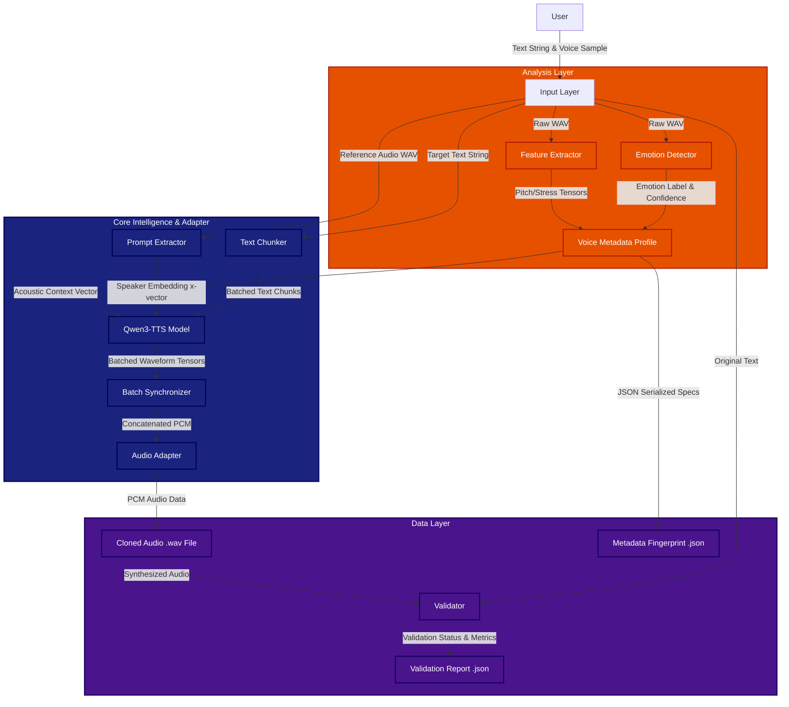

# System Architecture

The TTS Personalization Engine is a high-performance voice cloning pipeline powered by the **Qwen3-TTS** model. It enables real-time extraction of user-specific speech patterns and emotions, coupling them with large-scale pre-trained models for state-of-the-art zero-shot voice cloning.

## High-Level Architecture

The system follows a modular adapter-based architecture:

1.  **Input Layer**: Accepts **Raw Audio (Microphone/WAV)** and **Input Text (String)**.
2.  **Analysis Layer**: Processes **Raw Audio** to output **Acoustic Features** (F0, Energy) and **Emotion Labels**.
3.  **Core Intelligence**: The **Qwen3-TTS (0.6B/1.7B)** transformer model, which takes **Reference Style** and **Target Text** to output **Mel-Spectrograms/Waveforms**.
4.  **Adapter Layer**: A Windows-optimized PyTorch wrapper that converts **Model Tensors** into **WAV signals** with **Batch Processing** for voice consistency.
5.  **Data Layer**: Dual output system saving synthesized **Cloned Audio (.wav)** and its technical **Metadata Fingerprint (.json)**.

```mermaid
graph TD
    User[User] -->|Text String & Voice Sample| InputLayer[Input Layer]
    
    subgraph Analysis [Analysis Layer]
        InputLayer -->|Raw WAV| FE[Feature Extractor]
        InputLayer -->|Raw WAV| ED[Emotion Detector]
        FE -->|Pitch/Stress Tensors| Profile[Voice Metadata Profile]
        ED -->|Emotion Label & Confidence| Profile
    end
    
    subgraph Core [Core Intelligence & Adapter]
        Profile -->|Acoustic Context Vector| Qwen[Qwen3-TTS Model]
        InputLayer -->|Reference Audio WAV| Prompt[Prompt Extractor]
        InputLayer -->|Target Text String| Chunker[Text Chunker]
        Prompt -->|Speaker Embedding x-vector| Qwen
        Chunker -->|Batched Text Chunks| Qwen
        Qwen -->|Batched Waveform Tensors| Sync[Batch Synchronizer]
        Sync -->|Concatenated PCM| Adapter[Audio Adapter]
    end
    
    subgraph Data [Data Layer]
        Adapter -->|PCM Audio Data| WavOut[Cloned Audio .wav File]
        Profile -->|JSON Serialized Specs| JsonOut[Metadata Fingerprint .json]
        WavOut -->|Synthesized Audio| Val[Validator]
        InputLayer -->|Original Text| Val
        Val -->|Validation Status & Metrics| ReportOut[Validation Report .json]
    end

    %% Styling with High Contrast (Dark backgrounds with white text)
    classDef mainNode fill:#1a237e,stroke:#000051,color:#ffffff,stroke-width:2px;
    classDef analysisNode fill:#e65100,stroke:#ac1900,color:#ffffff,stroke-width:2px;
    classDef modelNode fill:#1b5e20,stroke:#003300,color:#ffffff,stroke-width:2px;
    classDef outputNode fill:#4a148c,stroke:#12005e,color:#ffffff,stroke-width:2px;
    
    class Qwen,Prompt,Chunker,Sync,Adapter,Core mainNode;
    class FE,ED,Profile,Analysis analysisNode;
    class Data,WavOut,JsonOut,ReportOut,Val outputNode;
```

## Component Details

### 1. Analysis Engine (`personalization_engine.feature_extractor`)
Derived from signal processing research, this component computes the "Voice DNA".
*   **Input**: Raw audio waveform (`np.ndarray` or WAV file).
*   **Output**: Multi-dimensional feature set including F0 Mean, Pitch Range, and RMS Energy.
*   **Pitch Analysis**: Fundamental Frequency (F0) tracking to capture user register.
*   **Energy/Stress**: RMS energy mapping to understand emphasis patterns.
*   **Speaking Rate**: Syllables-per-second estimation.

### 2. Emotion Intelligence (`personalization_engine.emotion_detector`)
A machine learning module that classifies the atmospheric "vibe" of the input.
*   **Input**: Mel-Frequency Cepstral Coefficients (MFCCs) extracted from input audio.
*   **Output**: Emotion Label (e.g., 'happy', 'neutral') and Confidence Score (0.0-1.0).
*   **Model**: SVM Classifier (`svm_model.pkl`).
*   **Dynamic Response**: Detects 7 core emotions including Happy, Sad, Angry, and Calm.

### 3. Qwen Adapter (`personalization_engine.qwen_adapter`)
The heart of the system, providing a high-level interface for complex model interactions with focus on consistency.
*   **Input**: Target Text (UTF-8), Reference Audio (WAV), and Model Configuration.
*   **Output**: High-fidelity synthesized waveform (WAV).
*   **Voice Consistency Logic**: Implements batched processing for multi-chunk inputs to prevent voice shifting between sentences.
*   **Embedding Reuse**: Pre-extracts `x-vector` speaker embeddings once per session, ensuring the model's internal prompt state remains identical for all outputs.
*   **Stability Controls**: Optimized inference parameters (Temperature: 0.7, Repetition Penalty: 1.1) to reduce acoustic artifacts in long-form speech.
*   **Text Chunker**: Intelligent semantic splitting (max 600 chars) that preserves natural breath pauses while maximizing throughput.

### 4. Interactive Interface (`run_qwen_interactive.py`)
A comprehensive command-line UI built with `Rich`.
*   **Iterative Workflow**: Maintains the model in memory to allow rapid text-to-speech loops without reloading weights.
*   **Auto-Play**: Integrated sounddevice playback for immediate feedback.
*   **Live Updates**: Allows re-recording the voice or changing inputs without restarting the session.

## Data Flow

### The "Clone & Batch" Pipeline
1.  **Capture**: User records 5 seconds of reference audio.
2.  **Extract**: Pitch, Energy, and Emotion are computed and cached; Voice prompt (x-vector) is pre-extracted.
3.  **Prepare**: Input text is split into semantic chunks (preserving sentence boundaries).
4.  **Synthesize (Batched)**: All text chunks are processed as a single parallel batch through the Qwen model using the pre-extracted voice prompt.
5.  **Reconstruct**: The resulting batched waveforms are concatenated, post-processed (e.g., speed adjustment), and normalized.
6.  **Persist**: The system writes a synchronized pair:
    *   `cloned_TIMESTAMP.wav`: The actual voice.
    *   `cloned_TIMESTAMP.json`: The technical specs and reference analysis.
    *   `cloned_TIMESTAMP_report.json`: Full validation metrics (match score, word count).

## Scaling & Implementation
*   **Model Switching**: Supports 0.6B Base for speed/low-RAM and 1.7B VoiceDesign for high-fidelity clones.
*   **Platform Independence**: Optimized for Windows PyTorch (CUDA/CPU) with fallback mechanisms for serial processing if batching exceeds VRAM limits.
