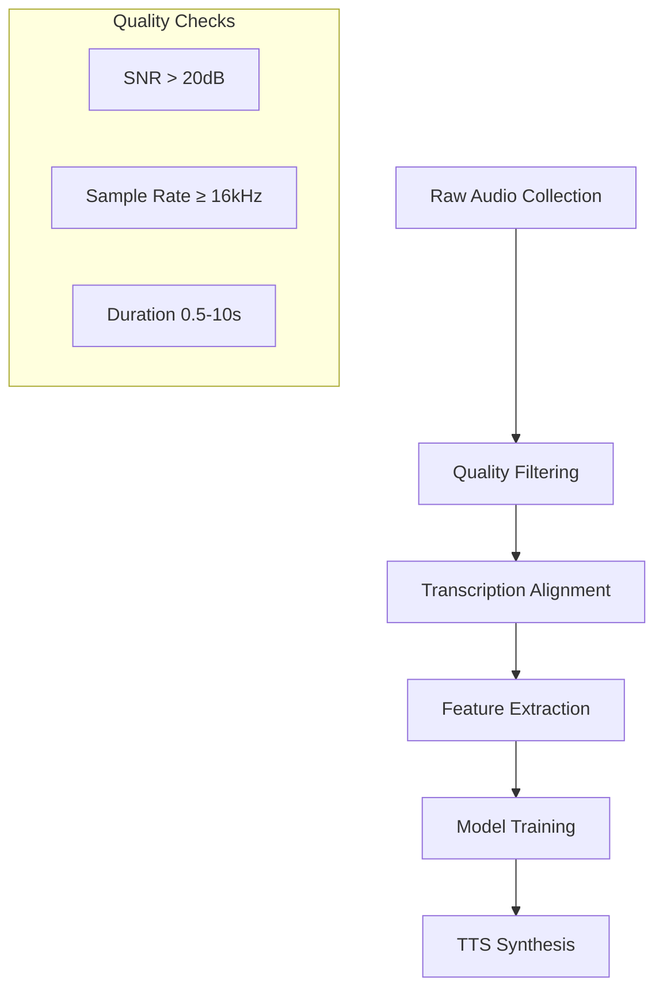

# TTS Dataset Analysis & Documentation

## Overview of Common TTS Datasets

### 1. LJSpeech
- **Size**: 24 hours
- **Speakers**: 1 female speaker
- **Quality**: 16kHz, high quality
- **Use Case**: Single-speaker TTS, clear articulation training

### 2. VCTK
- **Size**: 44 hours
- **Speakers**: 109 speakers (46 male, 63 female)
- **Diversity**: Multiple accents (mainly British English)
- **Use Case**: Multi-speaker TTS, accent modeling

### 3. LibriTTS
- **Size**: 585 hours
- **Source**: LibriVox audiobooks
- **Speakers**: 2,456 speakers
- **Use Case**: Large-scale, diverse speech synthesis

### 4. Hi-Fi Multi-Speaker
- **Size**: 292 hours
- **Speakers**: 10 speakers
- **Quality**: 44.1kHz, high SNR
- **Use Case**: High-fidelity speech synthesis

## Voice Quality Mapping

### Clarity Factors
- **Signal-to-Noise Ratio (SNR)**: Higher SNR (>30dB) improves clarity
- **Sample Rate**: ≥16kHz required for natural speech
- **Articulation**: Clear enunciation in source audio

### Naturalness Influencers
- **Prosody**: Natural rhythm and intonation patterns
- **Pauses**: Realistic inter-word and inter-sentence pauses
- **Breath Patterns**: Natural breathing sounds

### Accent Transfer
- Speaker accent in dataset directly transfers to synthesized speech
- Multi-accent datasets enable accent control
- Accent strength correlates with speaker consistency

## Dataset Selection Guidelines

| Target Voice Profile | Recommended Dataset | Key Considerations |
|---------------------|-------------------|-------------------|
| Clear, neutral voice | LJSpeech | Single speaker consistency |
| Multiple accents | VCTK | 109 speakers with accents |
| Emotional range | CREMA-D | Emotionally labeled samples |
| High fidelity | Hi-Fi Multi-Speaker | 44.1kHz samples |
| German language | HUI-Audio-Corpus | German-specific phonemes |

## Mermaid Diagrams

### Dataset Pipeline


## Dataset Analysis Logic Execution

### Sample Input
```python
datasets = ["LJSpeech", "VCTK", "LibriTTS", "HiFi", "HUI"]
```

### Execution Logs
```log
2026-02-03 16:30:00,123 - dataset_tools.analyzer - INFO - Analyzed dataset: LJSpeech
2026-02-03 16:30:00,123 - dataset_tools.analyzer - INFO - Analyzed dataset: VCTK
2026-02-03 16:30:00,123 - dataset_tools.analyzer - INFO - Analyzed dataset: LibriTTS
2026-02-03 16:30:00,123 - dataset_tools.analyzer - INFO - Analyzed dataset: HiFi
2026-02-03 16:30:00,123 - dataset_tools.analyzer - INFO - Analyzed dataset: HUI
```

### Sample Output (Generated JSON)
```json
{
  "LJSpeech": {
    "metrics": {
      "total_duration_hours": 24,
      "speaker_count": 1,
      "avg_recording_per_speaker_seconds": 86400.0,
      "data_density_hours_per_speaker": 24.0,
      "sample_rate_hz": 22050,
      "has_emotion_labels": false
    },
    "suitability": {
      "single_speaker": 100,
      "multi_speaker": 5,
      "emotional_tts": 30,
      "accent_modeling": 20,
      "overall_quality": 36.0
    },
    "voice_characteristics": {
      "clarity": "High",
      "naturalness": "High",
      "accent": "Neutral US English",
      "pitch_range": "Medium",
      "emotional_range": "Limited"
    }
  },
  "VCTK": {
    "metrics": {
      "total_duration_hours": 44,
      "speaker_count": 109,
      "avg_recording_per_speaker_seconds": 1453.211009174312,
      "data_density_hours_per_speaker": 0.4036697247706422,
      "sample_rate_hz": 48000,
      "has_emotion_labels": false
    },
    "suitability": {
      "single_speaker": 20,
      "multi_speaker": 100,
      "emotional_tts": 30,
      "accent_modeling": 85,
      "overall_quality": 58.5
    },
    "voice_characteristics": {
      "clarity": "Medium-High",
      "naturalness": "Medium",
      "accent": "Various UK accents",
      "pitch_range": "Wide",
      "emotional_range": "Limited"
    }
  },
  "LibriTTS": {
    "metrics": {
      "total_duration_hours": 585,
      "speaker_count": 2456,
      "avg_recording_per_speaker_seconds": 857.4918566775244,
      "data_density_hours_per_speaker": 0.23819218241042345,
      "sample_rate_hz": 24000,
      "has_emotion_labels": false
    },
    "suitability": {
      "single_speaker": 20,
      "multi_speaker": 100,
      "emotional_tts": 30,
      "accent_modeling": 60,
      "overall_quality": 51.0
    },
    "voice_characteristics": {
      "clarity": "Variable",
      "naturalness": "High (audiobook style)",
      "accent": "Mostly US English",
      "pitch_range": "Wide",
      "emotional_range": "Limited to narrative"
    }
  },
  "HiFi": {
    "metrics": {
      "total_duration_hours": 292,
      "speaker_count": 10,
      "avg_recording_per_speaker_seconds": 105120.0,
      "data_density_hours_per_speaker": 29.2,
      "sample_rate_hz": 44100,
      "has_emotion_labels": false
    },
    "suitability": {
      "single_speaker": 20,
      "multi_speaker": 50,
      "emotional_tts": 30,
      "accent_modeling": 20,
      "overall_quality": 29.0
    },
    "voice_characteristics": {
      "clarity": "Very High",
      "naturalness": "High",
      "accent": "Neutral US English",
      "pitch_range": "Medium",
      "emotional_range": "Limited"
    }
  },
  "HUI": {
    "metrics": {
      "total_duration_hours": 100,
      "speaker_count": 5,
      "avg_recording_per_speaker_seconds": 72000.0,
      "data_density_hours_per_speaker": 20.0,
      "sample_rate_hz": 48000,
      "has_emotion_labels": true
    },
    "suitability": {
      "single_speaker": 20,
      "multi_speaker": 25,
      "emotional_tts": 90,
      "accent_modeling": 20,
      "overall_quality": 42.0
    },
    "voice_characteristics": {
      "clarity": "High",
      "naturalness": "High",
      "accent": "German",
      "pitch_range": "Wide",
      "emotional_range": "Good (emotionally labeled)"
    }
  },
  "summary": {
    "total_duration_hours": {
      "best": "LibriTTS",
      "worst": "LJSpeech",
      "range": "24.0 - 585.0"
    },
    "speaker_count": {
      "best": "LibriTTS",
      "worst": "LJSpeech",
      "range": "1.0 - 2456.0"
    },
    "avg_recording_per_speaker_seconds": {
      "best": "HiFi",
      "worst": "LibriTTS",
      "range": "857.5 - 105120.0"
    }
  }
}
```
