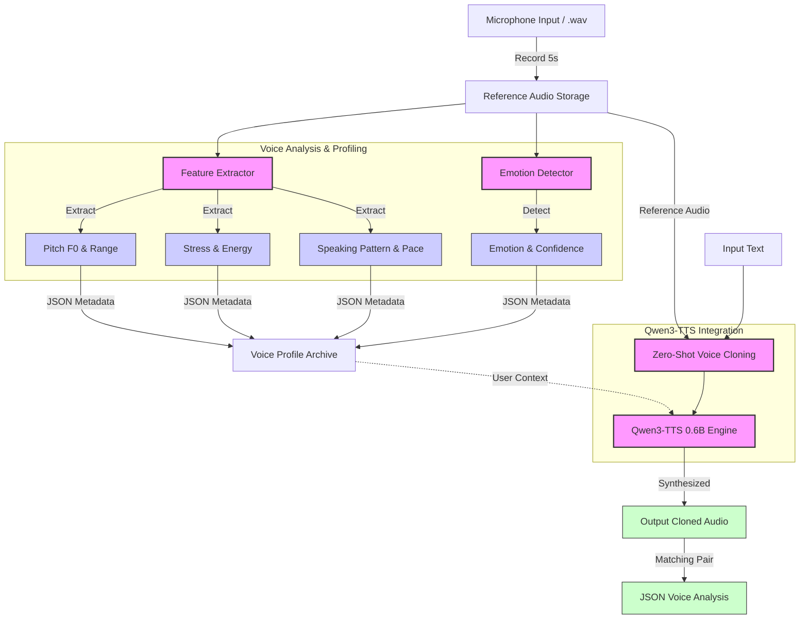

# System Data & Logic Flow

This diagram illustrates the personalized voice cloning pipeline, from raw microphone input to the final synthesized output with interactive analysis.

```mermaid
graph TD
    %% Input Stage
    Input[Microphone Input / .wav] -->|Record 5s| Rec[Reference Audio Storage]
    
    %% Analysis Stage
    subgraph Analysis [Voice Analysis & Profiling]
        FE[Feature Extractor] -->|Extract| Pitch[Pitch F0 & Range]
        FE -->|Extract| Energy[Stress & Energy]
        FE -->|Extract| Rhythm[Speaking Pattern & Pace]
        
        ED[Emotion Detector] -->|Detect| Emotion[Emotion & Confidence]
    end
    
    Rec --> FE
    Rec --> ED

    %% Model Integration Stage
    subgraph Model [Qwen3-TTS Integration]
        QTTS[Qwen3-TTS 0.6B Engine]
        Clone[Zero-Shot Voice Cloning]
    end
    
    %% Logical Flow
    Pitch & Energy & Rhythm & Emotion -->|JSON Metadata| Profile[Voice Profile Archive]
    Profile -.->|User Context| QTTS
    Rec -->|Reference Audio| Clone
    
    %% Synthesis Stage
    TEXT[Input Text] --> Clone
    Clone --> QTTS
    QTTS -->|Synthesized| WAV[Output Cloned Audio]
    
    %% Output Metadata
    WAV -->|Matching Pair| Meta[JSON Voice Analysis]

    %% Styling
    classDef main fill:#f9f,stroke:#333,stroke-width:2px;
    classDef analysis fill:#ccf,stroke:#333,stroke-width:1px;
    classDef model fill:#cfc,stroke:#333,stroke-width:1px;
    
    class QTTS,Clone,FE,ED main;
    class Pitch,Energy,Rhythm,Emotion analysis;
    class WAV,Meta model;
```
