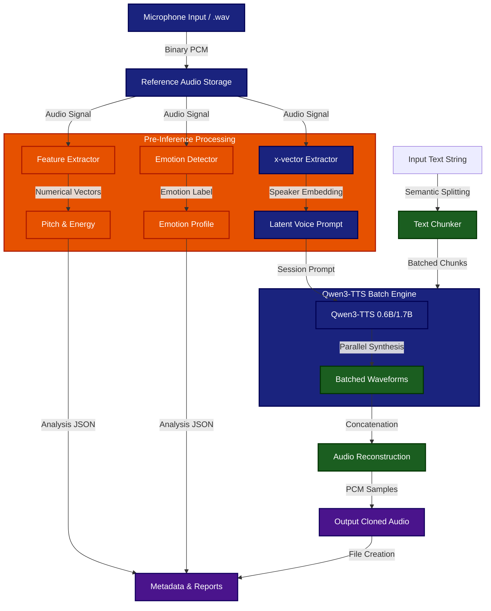

# System Data & Logic Flow

This diagram illustrates the personalized voice cloning pipeline, optimized for **Voice Consistency** through batched inference and pre-extracted speaker embeddings.

```mermaid
graph TD
    %% Input Stage
    Input[Microphone Input / .wav] -->|Binary PCM| Rec[Reference Audio Storage]
    
    %% Analysis & Prompt Stage
    subgraph PreProcessing [Pre-Inference Processing]
        direction LR
        FE[Feature Extractor] -->|Numerical Vectors| Pitch[Pitch & Energy]
        ED[Emotion Detector] -->|Emotion Label| Emotion[Emotion Profile]
        Prompt[x-vector Extractor] -->|Speaker Embedding| Embedding[Latent Voice Prompt]
    end
    
    Rec -->|Audio Signal| FE
    Rec -->|Audio Signal| ED
    Rec -->|Audio Signal| Prompt

    %% Batching Logic
    Text[Input Text String] -->|Semantic Splitting| Chunker[Text Chunker]
    Chunker -->|Batched Chunks| Engine

    %% Model Integration Stage
    subgraph Engine [Qwen3-TTS Batch Engine]
        direction TB
        Base[Qwen3-TTS 0.6B/1.7B]
        Embedding -->|Session Prompt| Base
        Base -->|Parallel Synthesis| BatchOut[Batched Waveforms]
    end
    
    %% Synthesis Stage
    BatchOut -->|Concatenation| Reconstruction[Audio Reconstruction]
    Reconstruction -->|PCM Samples| WAV[Output Cloned Audio]
    
    %% Output Metadata
    WAV -->|File Creation| Meta[Metadata & Reports]
    Pitch & Emotion -->|Analysis JSON| Meta

    %% Styling with High Contrast (Dark backgrounds with white text)
    classDef mainNode fill:#1a237e,stroke:#000051,color:#ffffff,stroke-width:2px;
    classDef analysisNode fill:#e65100,stroke:#ac1900,color:#ffffff,stroke-width:2px;
    classDef modelNode fill:#1b5e20,stroke:#003300,color:#ffffff,stroke-width:2px;
    classDef outputNode fill:#4a148c,stroke:#12005e,color:#ffffff,stroke-width:2px;
    
    class Engine,Base,Prompt,Embedding,QTTS,Clone,Input,Rec mainNode;
    class FE,ED,Pitch,Emotion,PreProcessing,Analysis,Profile analysisNode;
    class Chunker,BatchOut,Reconstruction,Adapter,Sync modelNode;
    class WAV,Meta,JsonOut,WavOut,ReportOut,Val outputNode;
```
